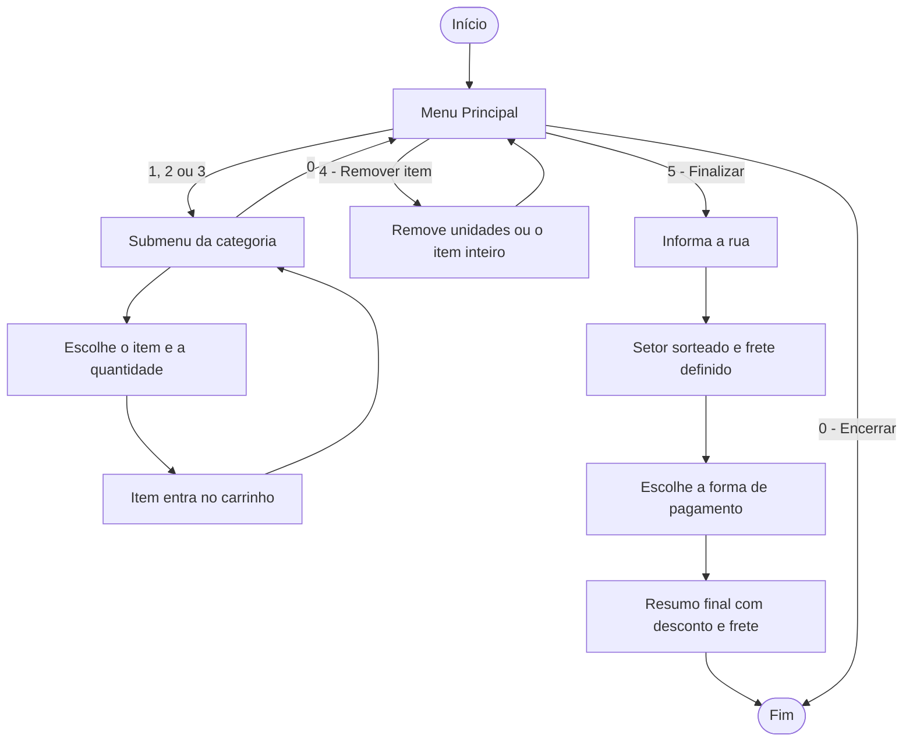

# Pizzaria Delivery — Sistema de Pedidos em Java

> Projeto A3 desenvolvido para a disciplina de Algoritmos e Programação.

---

## Índice

- [Sobre](#sobre)
- [Funcionalidades](#funcionalidades)
- [Cardápio](#cardápio)
- [Regras de Negócio](#regras-de-negócio)
- [Fluxo do Sistema](#fluxo-do-sistema)
- [Estrutura do Projeto](#estrutura-do-projeto)
- [Tecnologias Usadas](#tecnologias-usadas)
- [Como Executar](#como-executar)
- [Exemplo de Uso](#exemplo-de-uso)
- [Conceitos Aplicados](#conceitos-aplicados)
- [Autor](#autor)
- [Agradecimentos](#agradecimentos)

---

## Sobre

O **Pizzaria Delivery** é um sistema de pedidos em linha de comando, desenvolvido em **Java** como atividade prática (A3) da disciplina de Algoritmos e Programação. O programa simula o atendimento de uma pizzaria com entrega: o cliente navega pelo cardápio, monta o carrinho, remove itens, informa o endereço, escolhe a forma de pagamento e recebe o resumo completo do pedido com desconto e frete.

O foco do projeto está na **lógica de programação pura**: todo o sistema foi construído com **vetores (arrays)**, **estruturas de repetição** e **estruturas condicionais**, sem uso de coleções como `ArrayList`. A interface do terminal foi desenhada com caracteres de caixa (`╔ ═ ╗ ║ ╚ ╝`), e o carrinho aparece **ao lado do menu** em tempo real.

---

## Funcionalidades

| Funcionalidade | Descrição |
|---|---|
| Menu principal dinâmico | As opções de remover item e finalizar pedido só aparecem quando há itens no carrinho |
| Catálogo por categoria | Pizzas salgadas, pizzas doces e bebidas, cada uma com seu próprio submenu |
| Carrinho em tempo real | Exibido ao lado do menu principal, com quantidade, valor unitário, total por item e subtotal |
| Agrupamento de itens | Ao escolher um item que já está no carrinho, a quantidade é somada em vez de duplicar a linha |
| Remoção parcial ou total | Permite remover apenas algumas unidades ou o item inteiro |
| Cálculo de frete por setor | O setor de entrega é sorteado e define o valor do frete |
| Descontos por pagamento | Dinheiro, PIX e Débito têm desconto; Crédito não |
| Resumo final do pedido | Endereço, setor, itens, frete, desconto e total em uma única caixa |
| Validação de entradas | Bloqueia letras, opções inexistentes e quantidades inválidas sem travar o programa |

---

## Cardápio

### Pizzas Salgadas

| Nº | Sabor | Preço |
|---|---|---|
| 1 | Margherita | R$ 30,00 |
| 2 | Calabresa | R$ 35,00 |
| 3 | Quatro Queijos | R$ 40,00 |
| 4 | Portuguesa | R$ 45,00 |
| 5 | Napolitana | R$ 45,00 |
| 6 | Frango c/ Catupiry | R$ 35,00 |
| 7 | Mussarela | R$ 35,00 |
| 8 | Atum | R$ 40,00 |
| 9 | Basca | R$ 35,00 |
| 10 | Pepperoni | R$ 35,00 |
| 11 | Baiana | R$ 50,00 |
| 12 | Caipira | R$ 33,00 |
| 13 | Palmito c/ Azeitona | R$ 42,00 |
| 14 | Moda da Casa | R$ 44,00 |
| 15 | Calabresa c/ Catupiry | R$ 40,00 |
| 16 | Brócolis c/ Bacon | R$ 36,00 |
| 17 | Milho c/ Bacon | R$ 33,00 |
| 18 | Carne Seca c/ Catupiry | R$ 43,00 |
| 19 | Frango c/ Milho | R$ 37,00 |
| 20 | Alho e Óleo | R$ 34,00 |

### Pizzas Doces

| Nº | Sabor | Preço |
|---|---|---|
| 1 | Chocolate | R$ 30,00 |
| 2 | Banana com Canela | R$ 32,00 |
| 3 | Romeu e Julieta | R$ 35,00 |
| 4 | Morango c/ Chocolate | R$ 38,00 |

### Bebidas

| Nº | Bebida | Preço |
|---|---|---|
| 1 | Coca-Cola 2L | R$ 12,00 |
| 2 | Coca-Cola Lata | R$ 7,00 |
| 3 | Guaraná 2L | R$ 10,00 |
| 4 | Guaraná Lata | R$ 6,00 |
| 5 | Suco de Laranja | R$ 8,00 |
| 6 | Suco de Uva | R$ 8,00 |
| 7 | Água Mineral | R$ 4,00 |
| 8 | Cerveja Lata | R$ 6,00 |
| 9 | Cerveja Long Neck | R$ 9,00 |

---

## Regras de Negócio

### Entrega

O setor de entrega é **sorteado** com a classe `Random`, simulando a distância do cliente até a pizzaria.

| Setor | Distância | Frete |
|---|---|---|
| Setor A | 0 a 3 km | R$ 5,00 |
| Setor B | 3 a 6 km | R$ 8,00 |
| Setor C | 6 a 9 km | R$ 11,00 |
| Setor D | 9 a 12 km | R$ 14,00 |
| Setor E | 12 a 15 km | R$ 17,00 |

### Formas de pagamento

| Opção | Pagamento | Desconto |
|---|---|---|
| 1 | Dinheiro | 5% |
| 2 | PIX | 7% |
| 3 | Crédito | sem desconto |
| 4 | Débito | 3% |

### Cálculo do total

```
Subtotal dos itens = soma de (preço unitário × quantidade)
Desconto           = Subtotal × percentual da forma de pagamento
Total final        = (Subtotal − Desconto) + Frete
```

> O desconto incide **apenas sobre os itens**. O frete é somado depois e não recebe desconto.

---

## Fluxo do Sistema



---

## Estrutura do Projeto

```
A3-Algoritmos-e-Programacao/
│
├── Projeto_A3.java     # Código-fonte completo do sistema
└── README.md           # Documentação do projeto
```

### Organização interna do código

O programa é dividido em blocos dentro do método `main`:

| Bloco | Responsabilidade |
|---|---|
| Declaração de dados | Vetores paralelos com nomes e preços de pizzas, bebidas, setores, fretes e pagamentos |
| Carrinho | Quatro vetores paralelos (`itensPedido`, `precoUnitarioPedido`, `quantidadePedido`, `categoriaPedido`) com capacidade para 200 itens distintos |
| Menu principal | Montagem das linhas do menu e, se houver itens, do carrinho para impressão lado a lado |
| Submenus de categoria | Listagem dos produtos, leitura da escolha e da quantidade, e inclusão no carrinho |
| Remoção de itens | Redução de quantidade ou remoção total com reorganização do vetor |
| Finalização | Endereço, sorteio do setor, pagamento e impressão do resumo |

---

## Tecnologias Usadas


**Recursos da linguagem utilizados:** `Scanner`, `Random`, `String.format`, vetores, `do-while`, `while`, `for` e `boolean` de controle.

---

## Como Executar

### Pré-requisito

- **JDK 8 ou superior** instalado (verifique com `java -version`)

### Passo a passo

**1. Clone o repositório**

```bash
git clone https://github.com/GabrielMendesDiasSantos/A3-Algoritmos-e-Programacao.git
cd A3-Algoritmos-e-Programacao
```

**2. Compile**

```bash
javac Projeto_A3.java
```

**3. Execute**

```bash
java Projeto_A3
```

> Também é possível abrir o arquivo em uma IDE como **IntelliJ IDEA**, **Eclipse**, **NetBeans** ou **VS Code** e executar diretamente.
>
> Para os caracteres de caixa aparecerem corretamente, use um terminal com suporte a **UTF-8**.

---

## Exemplo de Uso

### Menu principal (carrinho vazio)

```
╔══════════════════════════════════════╗
║         PIZZARIA DELIVERY            ║
║         -- MENU PRINCIPAL --         ║
╠══════════════════════════════════════╣
║ 1 - Pizza salgada                    ║
║ 2 - Pizza doce                       ║
║ 3 - Bebidas                          ║
║ 0 - Encerrar codigo                  ║
╚══════════════════════════════════════╝
Escolha uma opcao:
```

### Resumo do pedido (exemplo)

Pedido com 2 pizzas Margherita e 1 Coca-Cola 2L, pago com PIX e entrega no Setor B:

```
╔════════════════════════════════════════════════════╗
║                 RESUMO DO PEDIDO                   ║
╠════════════════════════════════════════════════════╣
║ 01 Margherita                                      ║
║    2 x R$30,00 = R$60,00                           ║
║ 02 Coca-Cola 2L                                    ║
║    1 x R$12,00 = R$12,00                           ║
╠════════════════════════════════════════════════════╣
║ Rua: Rua das Flores                                ║
║ Setor: Setor B (3-6 km)                            ║
║ Frete: R$8,00                                      ║
║ Subtotal dos itens: R$72,00                        ║
║ Pagamento: PIX                                     ║
║ Desconto 7%: -R$5,04                               ║
╠════════════════════════════════════════════════════╣
║ Total com frete: R$74,96                           ║
╚════════════════════════════════════════════════════╝
```

**Cálculo do exemplo:** R$ 72,00 − R$ 5,04 (7%) = R$ 66,96, mais R$ 8,00 de frete = **R$ 74,96**.

---

## Conceitos Aplicados

- **Vetores paralelos:** nomes, preços, quantidades e categorias armazenados em arrays com o mesmo índice
- **Estruturas de repetição:** `do-while` para os menus, `while` para validação de entrada e `for` para percorrer o carrinho
- **Estruturas condicionais:** `if / else if / else` para navegação entre menus e regras de desconto
- **Validação de entrada:** uso de `hasNextInt()` para impedir que texto digitado quebre o programa
- **Manipulação de vetores:** deslocamento de elementos para preencher o espaço deixado por um item removido
- **Geração de números aleatórios:** sorteio do setor de entrega com `Random.nextInt()`
- **Formatação de saída:** `String.format` com largura fixa e truncamento (`%-36.36s`) para manter as caixas alinhadas
- **Variáveis de controle:** flag `boolean` para encerrar o sistema após finalizar o pedido
- **Organização e comentários:** código documentado linha a linha para facilitar a leitura

---

## Autor

| Nome | GitHub |
|---|---|
| Gabriel Mendes Dias Santos | [@GabrielMendesDiasSantos](https://github.com/GabrielMendesDiasSantos) |
| Henrique Tucci Lima | |
| Gustavo Souza dos Santos| |
| Riquelmi Sales Ribeiro | |
| Rodrigo | |
| Enzo Oliveira Ciarcia | |
| Alves | |

---

## Agradecimentos

Agradecimento a professora Andreia Machion e à instituição Universidade São Judas Tadeu pelo conteúdo e pelo apoio durante a disciplina de Algoritmos e Programação.

---
